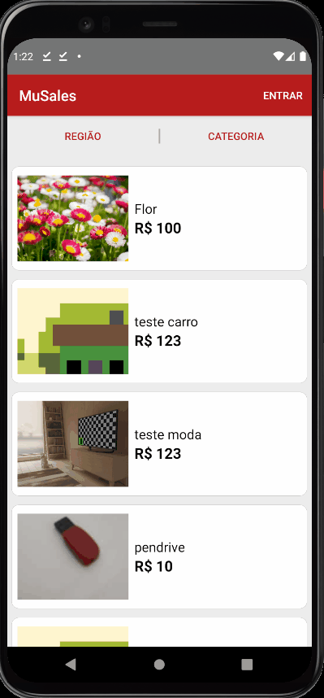

# MuSales

**MuSales** is a sales ads application.

This project is build with Clean Architecture, MVVM, Koin for DI, Jetpack libs (databinding, navigation, datastore...), Firebase as Back end and Coroutines to handle async codes.

